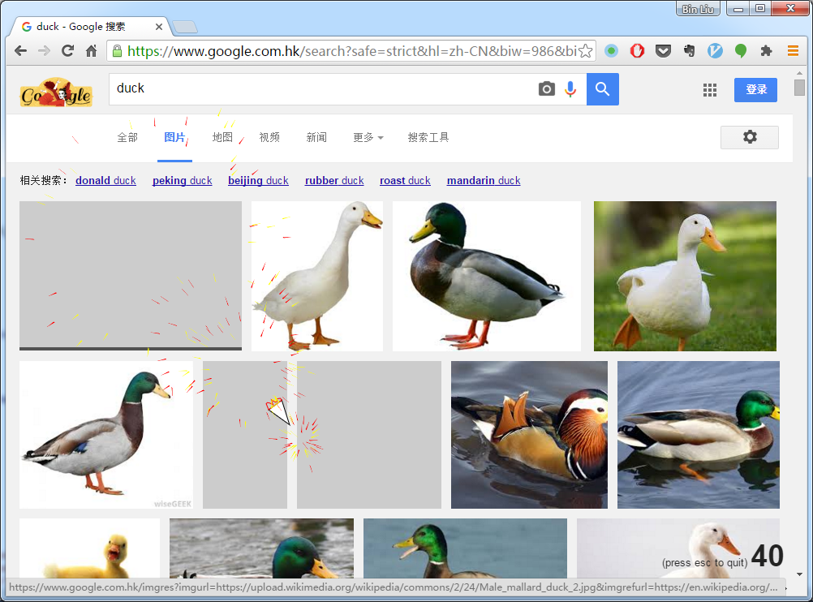
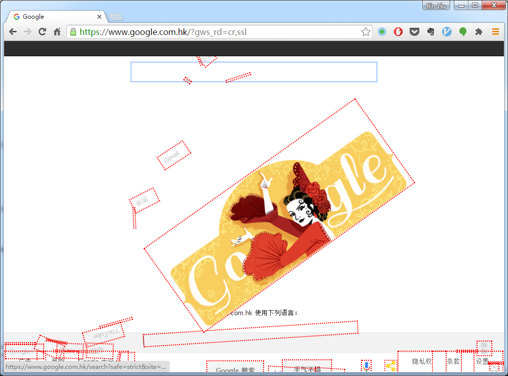
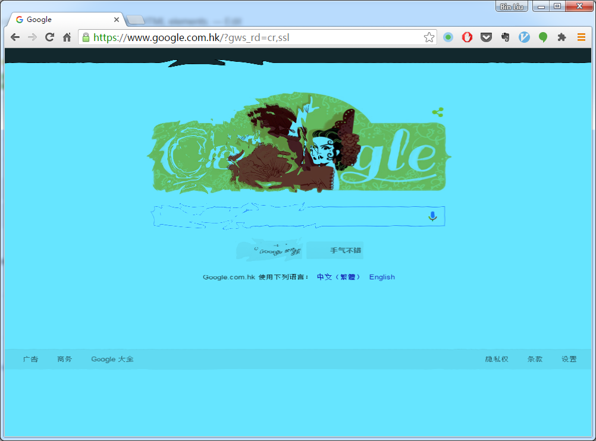

#### Overview
This a Chrome extension containing some games with the HTML elements.

#### Content
- ##### Asteroids
In this little game, you control a triangle-shaped spaceship using keyboard. Use arrow keys to move and space key to shoot bullets. When a bullet hit some HTML element, the element may explode.

- ##### Gravity
In this game, the HTML elements become blocks whose movement is managed by a simple physics engine called box-2d. You can drag a box, throw it away and make them collide with each other.

- ##### Pool
In this game, the browser window becomes a pool full of blue water. You are looking down at the bottom of the pool. You can make ripples by clicking anywhere.

